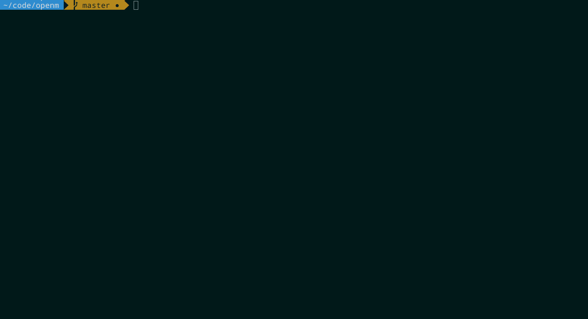

# openm
[](https://www.npmjs.com/package/openm)
[](https://travis-ci.org/dawsonbotsford/openm)
[](http://npmjs.org/openm)
[](https://github.com/sindresorhus/xo)

> open an npmjs module page in your browser

<br>



<br>

# CLI

## Install
```
$ npm install -g openm
```

## Usage

```
$ openm
  //=>opens the npmjs module page for the current directory in browser

$ openm chalk
  //=>opens the npmjs module page for chalk in browser

```

<br>

More help
```
$ openm --help

  Usage  
    $ openm
      //=>opens the npmjs module page for the current directory in browser

    $ openm <module name>
      //=>opens the npmjs module page for <module name> in browser'

  Examples  
    $ openm express
    //=>opens the npmjs module page for express in browser
```

<br>

---
# Package

## Install
```
npm install --save openm
```

<br>

## Usage

```js
const openm = require('openm');

openm('express');
//=> 'https://npmjs.com/module/express'
```

<br>

## API

### openm(target)

##### target

Type: `string`

Return the npmjs module page url as a string.

<br>

## License

MIT © [Dawson Botsford](http://dawsonbotsford.com)


---
If you like this, star it. If you want to follow me, follow me.
