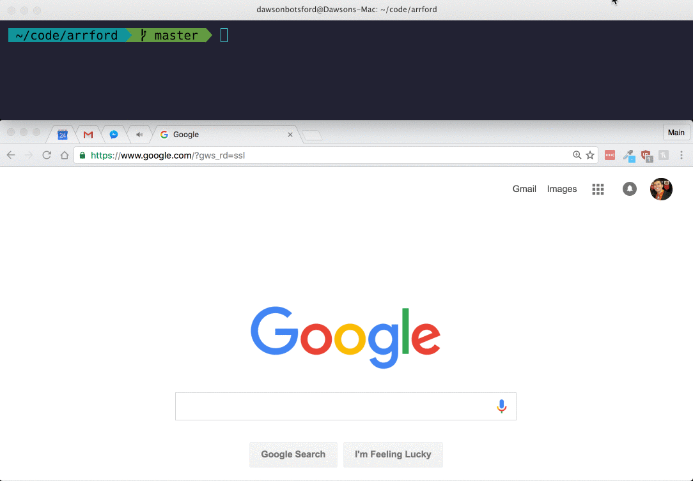

# openg
[](https://travis-ci.org/dawsbot/openg)
[](https://github.com/sindresorhus/xo)

> open Github repo pages for npm modules in-browser

<br>



<br>

# CLI

## Install
```
$ npm install -g openg-cli
```

If you'd rather have the API, [click here](/packages/openg)

<br>

## Usage

```sh
$ openg
# opens the github repo page for the current directory in browser

$ openg chalk
# opens the github repo page for chalk in browser

$ openg inf sist openg --issues
# opens the github issues pages for all in browser
```

<br>

More help
```sh
$ openg --help

  Usage
    $ openg [<options>]

    $ openg <module name(s)> [<options>]

  Options
    -i, --issues  Open the issue page for specified modules
    -d, --dryRun  List what links would be opened instead of opening

  Examples
    $ openg
    # opens the github repo page for the current directory in browser

    $ openg express
    # opens the github repo page for express in browser

    $ openg inf sist openg --issues
    #  opens the github issues pages for inf, sist, and openg in browser`,
```

<br>

## FAQ

#### How is this different than [npm repo](https://docs.npmjs.com/cli/repo)?

npm repo is an npm built-in. Here are the differences:

* `opts` allows you to open issues page(s)
* `openg` supports multiple module openings, `npm repo` supports only one at a time.

<br>

## Contribute

```js
npm run install
```

Since this is a [lerna](https://github.com/lerna/lern://github.com/lerna/lerna) project, both `openg-cli` and `openg` are contained within the `packages/` folder.

<br>

## Related

* [openm](https://github.com/dawsbot/openm)
* [opent](https://github.com/dawsbot/opent)

<br>

## License

MIT © [Dawson Botsford](http://dawsonbotsford.com)


---
If you like this, star it. If you want to follow me, follow me.
